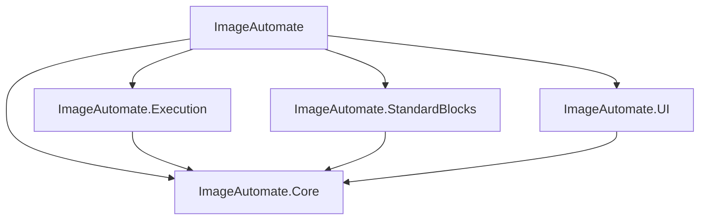

# ImageAutomate

**ImageAutomate** is a modular, node-based image processing framework designed to build execution pipelines. It separates logical graph definition from visualization and execution, enabling the construction of image manipulation workflows.

## Architecture

The system follows a **Core-Periphery** architecture, decoupling the core logic from the user interface and execution details.

The solution comprises the following key components:

*   **ImageAutomate.Core**: The central contract library defining the topology (`PipelineGraph`), data units (`WorkItem`, `Socket`), and interfaces (`IBlock`). It has no dependencies on UI frameworks.
*   **ImageAutomate.StandardBlocks**: A library of integrated standard image processing nodes (Resize, Crop, Blur, etc.) implemented using `SixLabors.ImageSharp`.
*   **ImageAutomate.UI**: The visualization layer responsible for rendering the graph using **GDI+** (System.Drawing).
*   **ImageAutomate.Execution**: The engine that validates the topology and orchestrates the dataflow.
*   **ImageAutomate**: The main WinForms application (Composition Root) that provides the visual editor and integrates the components.

### Execution Engine

The Execution Engine implements a **Pipes and Filters** architecture governed by a **Dataflow** model.

*   **Warehouses (Data Adapters)**: Act as buffers attached to the output of producer blocks. They manage data storage and implement "JIT Cloning" to optimize memory usage.
*   **Barriers (Control Adapters)**: Control structures attached to consumer blocks. They track dependencies and signal the engine when a block is ready for execution.

This design decouples blocks from one another. The Engine orchestrates execution based on data availability (Warehouses) and readiness signaling (Barriers).

## Core Concepts

### Node-Based Workflow

ImageAutomate allows the construction of image processing pipelines by connecting nodes (Blocks). Each node represents an operation, and connections represent the flow of image data.

### IBlock

All processing nodes implement the `IBlock` interface, which defines the contract for inputs, outputs, configuration, and execution logic.

*   **Inputs/Outputs**: Defined via `Socket`s.
*   **Configuration**: Blocks expose metadata and configuration options.

### Visualization

The UI is powered by `GraphRenderPanel`, a custom WinForms control in the `ImageAutomate.UI` library. It features:
*   Manual layout system.
*   Custom GDI+ rendering for nodes and connections.
*   Zoom and Pan capabilities.

## Standard Blocks

The project includes a suite of integrated standard blocks:

*   **I/O**: `LoadBlock`, `SaveBlock`.
*   **Transform**: `ResizeBlock`, `CropBlock`, `FlipBlock`, ...
*   **Effects**: `GaussianBlurBlock`, `PixelateBlock`, `HueBlock`, `VignetteBlock`, ...
*   **Format**: `ConvertBlock`.

## Getting Started

### Prerequisites

*   .NET 9.0 SDK
*   Visual Studio 2022 (or compatible IDE)

### Building and Running

1.  Clone the repository.
2.  Open `ImageAutomate.sln`.
3.  Set the **ImageAutomate** project as the Startup Project.
4.  Build and Run the application.

### Usage

1. Open an existing graph or create a new one
2. On the editor screen, drag nodes from the left sidebar onto the canvas
3. Drag from one output socket to an input to link nodes

**NOTE:** A graph must have at least one `LoadBlock`, one `SourceBlock`. All inputs must be connected, and graph must be acyclic.

## Extensibility

ImageAutomate is designed for extensibility. New blocks can be added via plugins.

1.  Create a Class Library referencing `ImageAutomate.Core`.
2.  Implement the `IBlock` interface.
3.  Compile and put the plugin in `plugins` directory (might not work)~~load the DLL via the application's Plugin Manager.~~

## Status

This project is in a **Prototype-Complete** state. The components (Core, Execution, UI, StandardBlocks) are functional.