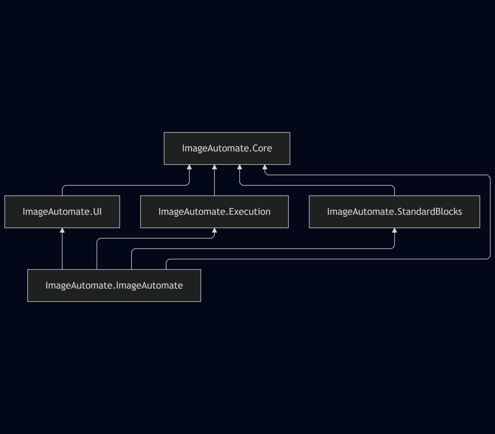

# Architecture

## Overview

ImageAutomate is designed as a dataflow system where images are processed through a pipeline of blocks.

## Core Components

*   **ImageAutomate.Core**: Defines the core interfaces (`IBlock`, `IWorkItem`, `PipelineGraph`) and data structures.
*   **ImageAutomate.UI**: Provides the visualization components (`GraphRenderPanel`) and UI logic.

## Execution Flow

The execution engine traverses the `PipelineGraph`. Blocks consume `WorkItem`s from their input sockets and produce `WorkItem`s on their output sockets.

## Parallel Processing

The system supports parallel execution of blocks where dependencies allow.
