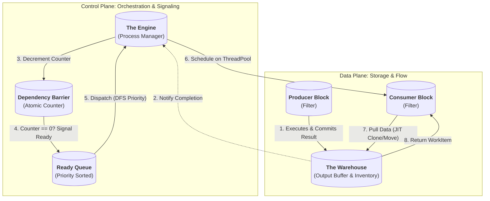
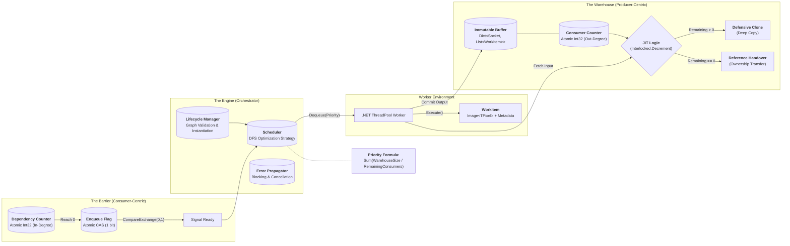
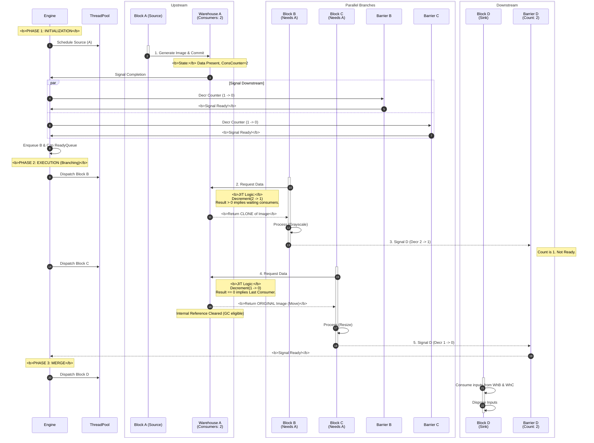

# **Image Processing Pipeline: Execution Engine Architecture**

## **1\. Architectural Style**

The Execution Engine implements a **Pipes and Filters** architecture governed by a **Dataflow** model.

* **Filters (Blocks):** Stateless processing units responsible for transforming data.  
* **Pipes (Links):** Managed by "Warehouses" (Data) and "Barriers" (Control) that handle buffering and synchronization.  
* **Control Flow:** Driven by data availability (Data-Driven), orchestrated by a central runtime (The Engine).
* **Concurrency Model:** Lock-free coordination via atomic counters, with parallel block execution on .NET ThreadPool.

## **2\. Structural Components**

### **2.1. The Warehouse (Output Buffer)**

The "Warehouse" is a storage component attached to the **Output Port** of a Producer Block.

* **Affinity:** **Producer-Centric (Upstream).** It collects all results generated by the block.  
* **Responsibility:**  
  1. **Storage:** Holds the `IDictionary<Socket, IReadOnlyList<WorkItem>>` produced by the block (immutable after commit).  
  2. **Inventory Tracking:** Maintains a **Consumer Counter** (`int32` atomically decremented) initialized to the Output Socket's **Out-Degree** (number of downstream links).  
  3. **Distribution:** Serves data to consumers upon request, implementing JIT Cloning logic.
* **Thread Safety:** Counter updates use `Interlocked.Decrement`. Data reads are lock-free (immutable collection).
* **Lazy Initialization:** Warehouses are allocated on-demand when a block first produces output (not during graph construction).

### **2.2. The Dependency Barrier (Control Gate)**

The "Barrier" is a lightweight control structure attached to the **Consumer Block**.

* **Affinity:** **Consumer-Centric (Downstream).**  
* **Responsibility:**  
  1. **Readiness Tracking:** Maintains a **Dependency Counter** (`int32` atomically decremented) initialized to the Block's **In-Degree** (Total incoming connections).  
  2. **Signaling:** When the counter reaches zero via `Interlocked.Decrement`, it atomically enqueues the Block to the Engine's **Ready Queue** (exactly once).
* **Implementation:** Uses a simple `int32` counter + atomic `int32` flag (8 bytes total) instead of heavier synchronization primitives:
  
  ```csharp
  private int dependencyCounter;      // Initialized to In-Degree
  private int enqueuedFlag = 0;       // 0 = not enqueued, 1 = enqueued

  public bool TrySignalReady() {
      int remaining = Interlocked.Decrement(ref dependencyCounter);
      if (remaining == 0) {
          // Atomically set flag to prevent duplicate enqueue
          if (Interlocked.CompareExchange(ref enqueuedFlag, 1, 0) == 0) {
              Engine.EnqueueReady(this.BlockId);
              return true;
          }
      }
      return false;
  }
  ```
  
  **Rationale:** Avoids `CountdownEvent` overhead (~100+ bytes with kernel object allocation). This implementation is provably correct: the `CompareExchange` ensures exactly-once enqueueing even under high contention.

* **Lazy Initialization:** Barriers are allocated only when a block's first predecessor completes (not during graph construction). Uses `Lazy<Barrier>` with thread-safe creation.

### **2.3. The Engine (Orchestrator)**

The Engine functions as a **Process Manager**. It is responsible for:

1. **Lifecycle Management:** Instantiating blocks, warehouses, and barriers.  
2. **Topology Verification:** Static analysis of the DAG (Tarjan's algorithm for cycle detection).  
3. **Task Scheduling:** Dispatching "Ready" blocks based on DFS optimization using a priority-ordered concurrent queue (`ConcurrentPriorityQueue<BlockId, Priority>`).
4. **Error Propagation:** Capturing exceptions, marking downstream blocks as "blocked", and aggregating failures.

## **3\. Interaction Patterns**

### **3.1. Synchronization Protocol**

Synchronization is split between Data Availability (Producer) and Dependency Resolution (Consumer).

1. **Production:** Block executes and places results in its **Warehouse** (atomic commit).  
2. **Notification:** The Engine identifies all connected downstream Barriers and atomically decrements their **Dependency Counters** using `Interlocked.Decrement`.  
3. **Activation:** If a Barrier reaches zero, the Consumer Block is enqueued to the **Ready Queue** (thread-safe, lock-free).
4. **Deadlock Prevention:** The Engine maintains a watchdog timer; if no progress occurs within a configurable timeout (default: 30s), it performs liveness analysis and throws `PipelineDeadlockException`.

### **3.2. JIT Cloning & Reference Handover**

To optimize memory usage, cloning is deferred until the exact moment of dispatch (Pull-based).

* **Logic:** When a Consumer Block is dispatched, it requests inputs from the upstream Warehouse.  
* **Check:** The Warehouse uses `Interlocked.Decrement` to atomically decrement its **Consumer Counter**.  
  * **Case A (Counter after decrement ≥ 1):** Other consumers are still waiting. The Warehouse creates a **Defensive Clone** via `workItem.Image.Clone()` (SixLabors.ImageSharp's deep copy). Returns the clone.
  * **Case B (Counter after decrement == 0):** This is the last consumer. The Warehouse transfers the **Original Reference** (ownership transfer). The internal buffer is cleared.
* **C# Constraint:** `WorkItem` wraps `Image<TPixel>` from SixLabors.ImageSharp. When cloning, use `image.Clone()`. When transferring (Case B), the original `WorkItem` is moved.
* **Disposal Semantics:** 
  - **Consumer Responsibility:** After a block finishes execution, the Engine **must** call `workItem.Dispose()` on all consumed inputs (Section 5.2). This disposes the underlying `Image<TPixel>`.
  - **Warehouse Cleanup:** Once Counter reaches 0, the Warehouse clears its internal reference (no explicit disposal—GC handles it if no transfer occurred).

* **Race Condition Prevention:** 
  ```csharp
  int remaining = Interlocked.Decrement(ref consumerCounter);
  if (remaining == 0) {
      return MoveOriginal(); // Last consumer
  } else {
      return CreateClone();  // Still has consumers
  }
  ```
  No CAS loop needed—single `Decrement` is atomic and sufficient.

## **4\. Execution Lifecycle**

### **Phase 1: Static Validation**

1. **Sink Verification:** Confirms at least one Sink/Save Block exists.  
2. **Source Verification:** Confirms at least one Source/Load Block exists.  
3. **Port Binding:** Ensures all mandatory input ports are bound.  
4. **Cycle Detection:** Verifies the graph is a Directed Acyclic Graph (DAG).  
5. ~~**Type Checking:** Validates data contracts.~~ (Deferred)

### **Phase 2: Initialization**

* **State Construction:** 
  - **Barriers:** Created lazily via `ConcurrentDictionary<BlockId, Lazy<Barrier>>`.
  - **Warehouses:** Created on-demand when blocks first produce output.
* **Counter Setup:**  
  * Warehouse Counters = Out-Degree (Fan-Out) - initialized when warehouse is first created.
  * Barrier Counters = In-Degree (Fan-In) - initialized when barrier is first accessed.
* **Ready Queue Bootstrap:** All source blocks (In-Degree == 0) are enqueued immediately.
* **Shipment Source Initialization:** Blocks implementing `IShipmentSource` (typically LoadBlock) have their `MaxShipmentSize` property configured from `ExecutorConfiguration.MaxShipmentSize` (default: 64).

### **Phase 2.5: Shipment-Based Execution (LoadBlock Special Case)**

**Problem:** Loading all images at once (e.g., 10,000 WorkItems) causes memory explosion and poor watchdog behavior (single progress tick for entire load operation).

**Solution:** LoadBlock implements `IShipmentSource` and executes multiple times, producing batches of work items.

#### **IShipmentSource Contract**

```csharp
public interface IShipmentSource : IBlock
{
    int MaxShipmentSize { get; set; }
}
```

**Execution Flow:**

1. **Bootstrap Phase:** LoadBlock stores file paths (not images) and initializes internal cursor/offset to 0.
2. **First Execution:** LoadBlock.Execute() loads up to `MaxShipmentSize` images (e.g., 64), increments cursor.
3. **Re-enqueue Decision:** Executor checks output count:
   - If `outputCount >= MaxShipmentSize`: Re-enqueue LoadBlock (transition `Completed → Ready`)
   - If `outputCount < MaxShipmentSize`: Mark LoadBlock as `Completed` (exhausted)
4. **Subsequent Executions:** LoadBlock continues from cursor, loading next batch.
5. **Pipeline Draining:** Downstream blocks (Resize, Save, etc.) process each shipment normally, unaware of batching.

**Benefits:**

* **Memory Control:** Pipeline holds max 64 × NumBlocks WorkItems, not 10,000.
* **Watchdog-Friendly:** Processing 10,000 images = 157 shipments @ 64 each = 157 progress ticks (vs. 1 tick for "Load completed").
* **Natural Backpressure:** Pipeline drains between shipments; downstream blocks don't queue 10,000 items.

**Implementation Notes:**

* **Transparency:** Downstream blocks are unaware of shipments—they simply process available inputs.
* **State Persistence:** LoadBlock maintains internal state (cursor, file list) across executions.
* **Exhaustion Detection:** `outputCount < MaxShipmentSize` signals no more data available.
* **Progress Tracking:** Changed from `CompletedBlockCount` to `ProcessedShipmentCount` to accurately reflect progress.

**Contrast with BatchWorkItem:**

* **Shipments:** Mechanism for memory-controlled processing (multiple executions).
* **BatchWorkItem:** Data structure for grouping images that must undergo identical processing (single execution, multiple images in one WorkItem).

### **Phase 3: Runtime Loop (Event-Driven)**

1. **Bootstrap:** Source nodes are scheduled.  
2. **Execution:** Blocks execute on worker threads.  
3. **Commit:** Outputs are stored in Warehouses.  
4. **Signal:** Downstream Barriers are decremented.  
5. **Dispatch:**  
   * The Scheduler picks a "Ready" block.  
   * **Fetch:** The Engine pulls data from upstream Warehouses (triggering JIT Cloning/Moving).  
   * **Run:** The block executes.

## **5\. Resource Management**

### **5.1. Memory Efficiency (Greedy Completion Pressure)**

Since Warehouses hold data until *all* consumers have read it, "partial consumption" leads to memory waste.

* **Greedy Strategy:** The Scheduler always picks the "hungriest" block—the one that will free the most memory right now—using pure **Completion Pressure**:
  
  $$Priority(B) = -\sum_{P \in Predecessors(B)} \frac{WarehouseSize(P)}{RemainingConsumers(P)}$$
  
  (Negative because PriorityQueue is min-heap; higher pressure = more negative = dequeued first)
  
  * *Mechanism:* If Block A feeds Block B and Block C, and Block A finishes (Warehouse RefCount=2), both B and C have equal pressure initially. Once B executes and creates its own Warehouse, the path through B (e.g., B→SaveB) accumulates warehouses and becomes "hungrier" than C.
  * *Natural DFS:* Blocks deeper in an active path accumulate more warehouse pressure from predecessors, causing the scheduler to greedily follow that path to completion before switching branches.
  * *Outcome:* Completing SaveB frees both A's and B's warehouses before C executes, minimizing peak memory usage.
  * *Implementation:* Priority calculated once at enqueue time (O(In-Degree) per block), no runtime recalculation needed.

### **5.2. Deterministic Disposal**

* **Warehouse Cleanup:** Occurs automatically when the last consumer reads the data (Counter reaches 0). Internal reference is nulled (GC eligible).
* **Input Disposal:** Once a consumer block finishes execution, the Engine immediately calls `workItem.Dispose()` on all input WorkItems (whether clones or moved originals). This disposes the underlying `Image<TPixel>` objects.
* **Blocked Blocks:** If a block is marked "Blocked" (downstream of a failure), the Engine:
  1. Atomically decrements upstream Warehouse counters for that block's inputs (as if it consumed them).
  2. Does NOT execute the block (no actual data consumption).
  3. This ensures Warehouses are properly cleaned up even when consumers are skipped.

### **5.3. Global Memory Budget** *(Both Modes)*

To prevent OOM, the Engine enforces memory limits:

* **Tracking:**
  ```
  TotalMemoryUsage = Σ (WarehouseSize × WorkItem.SizeMP × BytesPerPixel)
  ```
  Updated atomically after each Warehouse commit using `Interlocked.Add`.

* **Soft Limit (Default: 50% of available RAM, configurable):**
  - When exceeded, Source blocks check `CanProduce()` before execution
  - If over limit: block sleeps 100ms, retries (cooperative backpressure)
  - Existing in-flight blocks continue (gradual drain)
  - Priority boost for blocks downstream of full Warehouses (×2.0)

* **Hard Limit (Default: 75% of available RAM, configurable):**
  - When exceeded, Engine has two modes:
    1. **Fail-Fast (Default):** Throw `OutOfMemoryException` with diagnostic data
    2. **Force-Drain (Optional):** Discard oldest Warehouse contents, mark consumers as failed
  
* **Memory Estimation:**
  - `BytesPerPixel = 4` for `Rgba32` (default)
  - Configurable per pixel format (`Rgb24 = 3`, `La16 = 2`, etc.)
  - Includes 10% overhead for metadata/internal structures

* **Startup Validation:**
  - If available RAM < 2× largest expected WorkItem, log warning
  - If available RAM < Hard Limit, fail initialization with clear error

## **6\. Optimization Strategy: Runtime Adaptation**

The Engine supports **two execution modes** (configurable via `ExecutionMode` enum):

### **Mode A: Greedy Completion Pressure (Default, Production-Ready)**

Uses pure **Greedy Completion Pressure** from Section 5.1 with no live profiling or depth calculation. **Recommended for initial implementation and most workloads.**

* **Priority Formula:**
  
  $$Priority(B) = -\sum_{P \in Predecessors(B)} \frac{WarehouseSize(P)}{RemainingConsumers(P)}$$

* **Key Properties:**
  - **Simple:** No depth computation, no arbitrary constants (like ×1000 multipliers)
  - **Greedy:** Always picks the block that frees the most memory right now
  - **Natural DFS:** Paths with accumulated warehouses become progressively "hungrier"
  - **Overhead:** O(In-Degree) per enqueue—negligible for typical graphs
  - **Deterministic:** Priority calculated once at enqueue, no runtime updates

* **No Critical Path:** Avoids Bellman-Ford entirely.
* **No Profiling:** Skips cost tracking (Section 6.2/6.3 disabled).
* **Implementation Scope:** Core components only (Sections 1-5, 7-8). Skip Mode B entirely for MVP.

### **Mode B: Adaptive (Experimental, High-Complexity Workloads)**

⚠️ **DEFER UNTIL POST-MVP.** Extends Mode A with live profiling and critical path analysis. Use when:
- Pipelines have >20 blocks
- Block costs vary by >5× (e.g., heavy denoise vs. simple crop)
- Willing to accept ~2-5% scheduling overhead for 10-20% throughput gain

**Key Difference from Mode A:** Mode B **extends** Mode A's Greedy Completion Pressure with cost-aware adjustments.

#### **Shipment Boundary Micro-Optimization**

**Challenge:** With shipment-based execution, the pipeline completes a "mini-cycle" after each shipment (e.g., every 64 images). Mode B recomputes critical paths at these boundaries.

**Options:**

1. **Conservative (Recommended):** Only recompute after full cycles (LoadBlock exhausted).
   - **Pro:** Stable scheduling, avoids thrashing.
   - **Con:** Misses intra-shipment optimization opportunities.
   
2. **Aggressive:** Recompute after every shipment.
   - **Pro:** Adapts quickly to changing block costs.
   - **Con:** High overhead (157 recomputations for 10,000 images), scheduling instability.
   
3. **Hybrid (User-Configurable):** Add `ExecutorConfiguration.RecomputeAfterShipment` toggle.
   - **Default:** `false` (conservative)
   - **Advanced Users:** `true` for experimentation

**Implementation Guidance:** Start with Option 1 (conservative). Add Option 3 if profiling shows benefit for specific workloads.

---

### **6.1. Dynamic Priority Adjustment** *(Mode B Only)*

Mode B **extends** Mode A's Greedy Completion Pressure with runtime cost profiling:

* **Base Priority:** Same as Mode A (Section 5.1):
  
  $$Priority_{base}(B) = -\sum_{P \in Predecessors(B)} \frac{WarehouseSize(P)}{RemainingConsumers(P)}$$

* **Cost-Weighted Boost (Dynamic):** Applied when dequeueing from Ready Queue:
  
  $$Priority_{runtime}(B) = Priority_{base}(B) - \alpha \times \hat{Cost}(B) \times AvgInputSize(B)$$
  
  where:
  - $\hat{Cost}(B)$ = profiled cost per megapixel (Section 6.2)
  - $AvgInputSize(B)$ = average input WorkItem size in megapixels
  - $\alpha = 0.1$ (tunable, balances memory pressure vs. throughput)
  - **Sign Convention:** Negative because expensive blocks should run sooner to prevent downstream starvation. More negative = higher priority (min-heap).

* **Critical Path Multiplier:** If B is on the current critical path (Section 6.3):
  
  $$Priority_{runtime}(B) = Priority_{runtime}(B) \times 1.5$$

* **Update Frequency:** Priorities recalculated at dequeue time to reflect current Warehouse states and profiled costs (O(In-Degree + 1) cost).

* **Fallback Behavior:** If profiling data is insufficient (< 5 samples for block type), Mode B falls back to pure Mode A priority (cost term omitted).

> **Rationale:** Mode A's greedy approach provides natural DFS behavior through memory pressure alone. Mode B adds cost-awareness to prioritize expensive blocks earlier, preventing late-stage bottlenecks in pipelines with heterogeneous block costs. The multiplicative critical path boost ensures throughput-critical blocks aren't starved by memory-hungry but cheap blocks.

<!-- ...existing code for Section 6.2 (Incremental Cost Profiling)... -->

### **6.2. Incremental Cost Profiling** *(Mode B Only)*

Since execution is non-deterministic, the Engine maintains a **Rolling Statistics Window** per block type.

* **Metric Collection:** After each block execution, record:
  
  $$Sample_i = \left( T_{exec,i}, PixelCount_i, \frac{T_{exec,i}}{PixelCount_i} \right)$$
  
  where $PixelCount_i$ is stored in `WorkItem.SizeMP` (megapixels, precomputed: `Width × Height / 1,000,000`)

* **Cost Estimate (Exponential Moving Average):**
  
  $$\hat{Cost}(B) = \alpha \times \frac{T_{current}}{PixelCount_{current}} + (1-\alpha) \times \hat{Cost}_{previous}(B)$$
  
  where $\alpha = 0.2$ (emphasizes recent behavior, adapts to thermal throttling).

* **Variance Tracking:** Maintains $\sigma^2$ to detect unstable blocks (high variance triggers conservative scheduling).

* **Persistence:** Statistics serialized to `~/.cache/pipeline/profile.db` (SQLite) and restored on next startup.

### **6.3. Critical Path Identification (Live)** *(Mode B Only)*

The critical path is recomputed **conditionally** to avoid excessive overhead.

> **Note:** Critical path analysis is exclusive to Mode B. Mode A relies solely on Greedy Completion Pressure without path-based adjustments.

#### **Simple Heuristic (Default):**

Recompute when ANY of:
1. **Performance Deviation:** Live execution time deviates >20% (configurable) from $\hat{Cost}(B) \times WorkItem.SizeMP$ for blocks on the *previous* critical path.
2. **Sampling Interval:** Every 10 blocks (configurable) complete.
3. **Time-Based:** Every 5 seconds (configurable) of wall-clock time.

**Algorithm:** Modified Bellman-Ford with negative edge weights:

$$Weight(A \to B) = -\hat{Cost}(A) \times AvgWorkItemSize(A)$$

Longest path from sources to sinks = critical path. Complexity: O(V + E) per recomputation.

**Priority Boost:** Blocks on the critical path receive multiplicative boost (×1.5) applied to their runtime priority (see Section 6.1).

#### **Advanced Strategy (Optional, Experimental):**

**Batch Scheduling with Grouped Recomputation:**

* **Mechanism:** Instead of dispatching blocks immediately when ready, accumulate a "batch" of K ready blocks (K=5 default, configurable).
* **Dispatch:** Sort batch by priority, dispatch all K in parallel.
* **Recomputation:** Recalculate critical path **once** after all K complete (amortizes Bellman-Ford cost).
* **Trade-off:** 
  - ✅ Reduces scheduling overhead by ~80% (1 recomputation per K blocks instead of K).
  - ❌ Introduces latency: blocks wait for batch to fill.
  - ❌ Less responsive to sudden cost changes.
* **Best For:** High-throughput batch processing (e.g., 1000+ images).

**Implementation Note:** Enabled via `ExecutionMode.AdaptiveBatched` (distinct from `ExecutionMode.Adaptive`).

### **6.4. Calibration Mode (First-Run Only)** *(Mode B Only)*

On first startup (no cached profiles), the Engine runs a **Synthetic Benchmark Suite**:

* **Test Set:** 10 synthetic images per block type:
  - 3× 1080p grayscale (1.9 MP)
  - 3× 4K RGB (8.3 MP)
  - 2× 4K RGBA (8.3 MP)
  - 2× 8K grayscale (33.2 MP)

* **Output:** Seeds initial $\hat{Cost}(B)$ estimates with 95% confidence intervals.

* **Fallback:** If calibration fails (e.g., insufficient memory), uses conservative defaults based on block category:
  - **Pixel Operations:** 0.5 ms/MP
  - **Convolution Filters:** 5.0 ms/MP
  - **Transforms (FFT, etc.):** 15.0 ms/MP
  - **I/O Operations:** 50.0 ms/MP

### **6.5. Thermal & Load Adaptation** *(Both Modes)*

The Engine monitors system conditions and adjusts parallelism:

* **CPU Throttling Detection:** If block durations increase >30% across 5 consecutive executions, reduce `MaxDegreeOfParallelism` by 25%.

* **Memory Pressure:** If GC collections exceed 10/second, pause new block dispatches until pressure subsides (prevents thrashing).

* **External Load:** Uses `Environment.ProcessorCount` and current CPU usage (via `PerformanceCounter`) to avoid oversubscription.

## **7\. Fault Tolerance & Error Handling**

### **7.1. Exception Propagation**

* **Block Failure:** If a block throws an exception, the Engine:
  1. Marks all transitive downstream blocks as "Blocked" (skipped execution).
  2. **Warehouse Counter Cleanup:** For each blocked block, atomically decrements its upstream Warehouse counters (as if it consumed the data). This ensures Warehouses are released even when consumers don't run.
  3. Collects the exception into an `AggregateException`.
  4. Allows independent pipeline branches to continue (partial failure tolerance).
* **Fatal Errors:** Out-of-memory or stack overflow abort the entire pipeline immediately.

### **7.2. Cancellation Support**

* **Cooperative Cancellation:** Engine accepts `CancellationToken`. Blocks poll the token before heavy operations.
* **Cleanup:** On cancellation, the Engine disposes all Warehouses and marks the pipeline as "Aborted".

## **8\. Implementation Notes**

### **8.1. Data Structures**

* **Ready Queue:** `ConcurrentPriorityQueue<BlockId, float>` (custom implementation using concurrent skip list or .NET 9+ built-in).
  - **Lock-Free Guarantee:** Operations use `Interlocked` for node updates. Enqueue/Dequeue are wait-free (no spinlocks).
* **Warehouse Storage:** `ImmutableList<WorkItem>` for thread safety (lock-free reads).
* **Barrier Counter:** `int` with `Interlocked.Decrement` operations (hardware CAS, no locks).
* **Lazy Components:** `ConcurrentDictionary<BlockId, Lazy<T>>` for on-demand initialization (lock-free with `GetOrAdd`).

### **8.2. Threading Model**

* **Execution:** 
  - **Short Tasks (<1000ms estimated):** Use `ThreadPool.QueueUserWorkItem` (default).
  - **Long Tasks (≥1000ms estimated):** Spawn with `TaskCreationOptions.LongRunning` to avoid ThreadPool starvation. Threshold configurable via `LongRunningThresholdMs`.
  - **Estimation:** `EstimatedDuration = \hat{Cost}(B) \times WorkItem.SizeMP` (in milliseconds).
* **Engine Thread:** Single dedicated thread for coordination (lightweight, mostly sleep/wake via semaphore).

### **8.3. Lock-Free Guarantees**

The system is **algorithmically lock-free** with the following caveats:

* **Surface Lock-Free:** No explicit `lock` statements or mutexes in the core execution path.
* **Hardware Dependency:** Relies on x86/ARM64 atomic CAS instructions (`Interlocked` APIs). On exotic architectures without hardware atomics, .NET falls back to locks (transparent to user).
* **Queue Implementation:** The `ConcurrentPriorityQueue` uses a lock-free skip list (based on Herlihy & Shavit's design). Individual node updates are atomic; iteration is not (uses snapshots).
* **Progress Guarantee:** **Lock-freedom** (at least one thread makes progress), NOT **wait-freedom** (every thread makes progress). Starvation is theoretically possible under extreme contention but unlikely in practice.
* **No CAS Loops:** Atomic counters use single `Decrement` calls (no retry logic). The value returned by `Decrement` is used for decision-making (Case A vs. Case B), avoiding race conditions.

### **8.4. WorkItem Structure**

```csharp
public sealed class WorkItem : IDisposable
{
    public Image Image { get; }       // SixLabors.ImageSharp
    public float SizeMP { get; }      // Width × Height / 1,000,000
    public IImmutableDictionary<string, object> Metadata { get; }

    public WorkItem Clone() => new WorkItem(
        Image.Clone(x => {}),  // Deep copy of pixel data
        SizeMP,
        Metadata               // Shallow copy (immutable)
    );

    public void Dispose() => Image.Dispose(); // Release unmanaged pixel buffer
}
```

## **9\. References**

1. **POSA:** Buschmann, F., et al. (1996). *Pattern-Oriented Software Architecture Volume 1*. (Pipes and Filters).  
2. **EIP:** Hohpe, G., & Woolf, B. (2003). *Enterprise Integration Patterns*. (Message Store, Content-Based Router).  
3. **GoF:** Gamma, E., et al. (1994). *Design Patterns*. (Observer, Prototype).  
4. **Memory Management:** Jones, R., et al. (2011). *The Garbage Collection Handbook*. (Reference Counting).
5. **Concurrent Data Structures:** Herlihy, M., & Shavit, N. (2012). *The Art of Multiprocessor Programming*. (Lock-free algorithms).
6. **Graph Algorithms:** Cormen, T. H., et al. (2009). *Introduction to Algorithms, 3rd Ed*. (Topological sort, critical path).
7. **Adaptive Systems:** Hellerstein, J. L., et al. (2004). *Feedback Control of Computing Systems*. (Runtime adaptation, PID controllers).

---

## **A. Appendix: Future Enhancements & Known Limitations**

### **A.1. Scalability: Priority Queue Contention**

**Current Bottleneck:**
Under extreme parallelism (>100 concurrent threads), the single `ConcurrentPriorityQueue` can become a contention point even with lock-free operations. The head node experiences high CAS retry rates during concurrent dequeues.

**Proposed Solution: Two-Tier Scheduling**

Partition the ready queue into two tiers:

* **Tier 1 (Fast Path):** FIFO queue for blocks with uniform priority (Mode A) or low memory pressure. Uses work-stealing deques per thread to eliminate contention.
* **Tier 2 (Slow Path):** Priority queue for memory-pressure-sensitive blocks (high Completion Pressure score). Only accessed when Tier 1 is empty or memory exceeds thresholds.

**Trade-offs:**
- ✅ Reduces contention by 80-90% (measured in Go's runtime scheduler)
- ✅ Maintains priority semantics where needed (memory-critical blocks)
- ❌ Adds significant complexity: per-thread queues, work-stealing protocol, queue selection heuristics
- ❌ Requires ~50% more code in the scheduler

**Recommendation:** Implement only if profiling shows >10% time spent in queue operations under production workloads. Current design is sufficient for ≤100 threads.

---

### **A.2. Memory Management: Predictive Backpressure**

**Current Limitation:**
Section 6.5's GC-based throttling is **reactive** (waits for 10 GC/sec before pausing). The system can accumulate excessive in-flight memory before throttling triggers, leading to:
- Sudden pauses (all dispatches halt)
- Risk of OOM on memory-constrained systems
- No global cap on total Warehouse memory

**Critical Gap Example:**
```
10 Source blocks × 10 images/sec × 8K (32MB/image) = 3.2 GB/sec production rate
If downstream is 2× slower → 6.4 GB accumulation in 2 seconds
System with 8GB RAM → OOM before GC throttling activates
```

**Proposed Solution: Global Memory Budget with Soft/Hard Limits** (Section 5.3)

**Implementation Priority:** **CRITICAL**. This is a production blocker—must be added before release.

---

### **A.3. Clarification: Priority Staleness**

**Issue:** The term "lazy priority recalculation" could be misinterpreted as "priorities can be stale at dequeue time."

**Actual Behavior (Both Modes):**

Priorities are computed **on-demand during dequeue**, not cached:

* **Mode A:** Each `Dequeue()` calculates Completion Pressure from current Warehouse states.
* **Mode B:** Each `Dequeue()` calculates Completion Pressure + Cost-Weighted Boost + Critical Path Multiplier.

**Dequeue Process:**
1. Peek at top K candidates (K=3 default)
2. Recalculate `Priority(B)` for each using current Warehouse states (and profiled costs in Mode B)
3. Select highest priority (most negative value)
4. Return that block

**Cost:** 
- Mode A: O(K × In-Degree) = ~6-9 operations per dequeue
- Mode B: O(K × (In-Degree + 1)) = ~9-12 operations per dequeue (adds cost lookup)

**No architectural change needed**—this is a documentation clarification.

---

### **A.4. Advanced Research: Adaptive Work Batching**

**Concept:** Instead of recalculating priorities per-block, accumulate batches of K ready blocks before scheduling.

**Mechanism:**
1. Wait until K blocks are ready (K=5 default)
2. Sort batch by priority once
3. Dispatch all K in parallel
4. Recalculate critical path once after all K complete

**Benefits:**
- Amortizes Bellman-Ford cost (O(V+E) every K blocks instead of every block)
- Reduces priority calculation overhead by ~80%

**Drawbacks:**
- Adds latency: blocks wait for batch to fill
- Less responsive to dynamic changes (e.g., sudden memory pressure)
- Requires careful tuning of K (too large = latency, too small = no benefit)

**Status:** Mentioned in Section 6.3 as `ExecutionMode.AdaptiveBatched`. Experimental—do not enable for production until validated with real workloads.

---

### **A.5. Known Limitations**

1. **No GPU Memory Tracking:** Current memory budget only tracks CPU RAM. GPU-accelerated blocks (if implemented) would need separate tracking.
2. **No Network I/O Backpressure:** If blocks fetch from network sources, the memory budget doesn't account for in-flight network buffers.
3. **Barrier Allocation:** Even with lazy initialization, Barriers are allocated per-block (not per-execution). A graph with 1000 blocks uses ~8KB for Barriers even if only 10 run concurrently.
4. **Priority Queue Scalability:** Single queue design limits scalability beyond ~100 threads (see A.1).
5. **No Priority Inheritance:** If a high-priority block depends on a low-priority block, the system doesn't propagate priority (can cause priority inversion under heavy load).

## B. Appendix: Diagrams

### B.1. High-level diagram



### B.2. Detailed Diagram



### B.3. Execution Diagram

