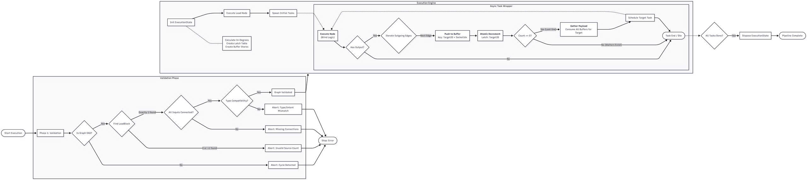

# Execution Engine Design

The **Execution Engine** is the core component responsible for traversing the `PipelineGraph` and orchestrating the execution of `IBlock` nodes. It ensures that data flows correctly from source to target blocks, handling synchronization, data isolation (branching), and resource management.

## Overview

The engine operates on a conceptual "Push" model where blocks produce work items that are pushed to their successors. However, the execution is managed centrally to ensure correctness and efficiency.

Key responsibilities:
1.  **Validation**: Ensuring the graph is a valid Directed Acyclic Graph (DAG) and all connections are valid.
2.  **Scheduling**: Determining which blocks are ready to execute based on data availability.
3.  **Data Isolation**: Ensuring that branches in the graph receive independent copies of data (Cloning).
4.  **Synchronization (Latching)**: Waiting for all required inputs before a block executes.

## Core Concepts

### 1. Work Item Propagation
Blocks exchange `WorkItem`s. When a block finishes execution, its output work items are propagated to the input sockets of connected downstream blocks.

### 2. Branching & Cloning
A critical requirement is **Data Isolation**. If a block's output socket is connected to multiple target blocks (branching), the engine must ensure that each target receives its own independent copy of the image data.

*   **Scenario**: `LoadBlock` connects to `ResizeBlock` and `CropBlock`.
*   **Mechanism**: The engine detects multiple outgoing connections from a single socket. It clones the underlying image and wraps it in a new `WorkItem` for each target branch.
*   **Optimization**: To minimize overhead, the engine employs a "Transfer last, Clone others" strategy. The original work item is transferred to one target (the last one processed), while clones are created for all preceding targets.
*   **Benefit**: Modifications in one branch do not affect the other, and unnecessary allocation is avoided for the final consumer.

*Figure 1: Left - Branching (Load to Resize/Crop) requires cloning. Right - Merge (Icon/Backdrop to Overlay) requires waiting.*

### 3. Latching (Synchronization)
Nodes with multiple input sockets (e.g., `OverlayBlock` or `ConvertBlock` in the example) must wait until **all** connected inputs have received data before they can execute.

*   **Latch Count**: Each node has a latch counter initialized to its "In-Degree" (number of incoming connections).
*   **Atomic Decrement**: As an upstream block delivers a work item, the target's latch is decremented.
*   **Trigger**: When the latch reaches zero, the block is scheduled for execution.

## Execution Flow

The execution follows a multi-phase process, as illustrated below.

*Figure 2: Conceptual Flowchart of the Execution Engine.*

### Phase 1: Validation
Before execution begins, the engine validates the graph:
1.  **DAG Check**: Ensures there are no cycles.
2.  **Connectivity**: Verifies that all required inputs are connected.
3.  **Type Compatibility**: Checks if connected sockets are compatible.
4.  **Source Identification**: Locates source nodes (e.g., `LoadBlock`).

### Phase 2: Initialization
The engine prepares the **Execution State**:
*   **Latch Table**: Calculates the in-degree for every node and stores it in a thread-safe table.
*   **Buffer Stores**:Allocates buffers to hold incoming `WorkItem`s for each node's input sockets.

### Phase 3: Execution Loop (Async)
The engine spawns tasks for source nodes and enters an async execution loop.

1.  **Execute Node**: The block's `Execute()` method is called with input items.
2.  **Iterate Outgoing Edges**: For each output socket:
    *   Identify all connected target links.
    *   **Clone if Branching**: If there are multiple targets, clone the image/WorkItem for all but the last target. The last target receives the original.
    *   **Push to Buffer**: Store the result in the target's specific input buffer.
    *   **Decrement Latch**: Atomically decrement the target's latch counter.
3.  **Check Latch**:
    *   If `Latch == 0`: This was the last required input.
    *   **Gather Payload**: Retrieve all buffered inputs for the target.
    *   **Schedule Target**: Dispatch the target node for execution (subject to concurrency limits).
    *   If `Latch > 0`: Do nothing; the target is still waiting for other inputs.
4.  **Completion**: When all tasks are done and no nodes are pending, the pipeline is complete.

## Concurrency & Scalability

In wide graphs, simply spawning a new `Task` for every ready node can lead to thread pool saturation and context switching overhead. To ensure robustness and scalability:

*   **Concurrency Limiting**: The engine should enforce a maximum degree of parallelism (e.g., via `ParallelOptions.MaxDegreeOfParallelism` or a `SemaphoreSlim`).
*   **Task Scheduling**: Instead of `Task.Run` immediately, ready nodes should be queued to a bounded scheduler that manages worker threads efficiently.
*   **Benefits**: Prevents system overload during heavy processing and ensures predictable performance characteristics regardless of graph width.

## Resource Management & Disposal Strategy

Proper disposal of image resources (`WorkItem`s) is crucial to prevent memory leaks, especially when processing high-resolution images.

### 1. Ownership & Consumption
*   **Engine Ownership**: The `ExecutionState` is the ultimate owner of all in-flight `WorkItem`s while they are buffered or being passed between blocks.
*   **Block Execution**: When a block executes, it receives `WorkItem`s as input. It treats them as read-only (unless it's the sole owner and modifies in-place, though immutability is preferred). It produces *new* `WorkItem`s as output.
*   **Input Disposal**: Once a block has successfully executed and produced its output:
    *   The Engine is responsible for disposing of the **Input WorkItems** that were passed to that block.
    *   **Rationale**: Those specific instances of `WorkItem` have served their purpose (feeding the block) and are no longer needed.
    *   **Note**: Because of the branching strategy (cloning), each branch has its own unique `WorkItem` instances. Disposing the input to one branch does not affect others.

### 2. Pipeline Cleanup
*   **Successful Completion**: Upon pipeline completion, the `ExecutionState` disposes of any lingering resources. (Ideally, all inputs were consumed and disposed during execution, and final outputs are handed over to the caller).
*   **Error Termination**: If the pipeline is aborted due to an error:
    *   The `ExecutionState` iterates through all **Buffer Stores**.
    *   It calls `Dispose()` on every buffered `WorkItem` that was waiting to be processed.
    *   This ensures that images stranded in the pipeline are correctly released.

### 3. Final Outputs
*   The `WorkItem`s produced by the final blocks (leaf nodes) are **not** disposed by the Engine.
*   They are collected and returned to the caller of the pipeline execution.
*   **Caller Responsibility**: The caller assumes ownership of the final results and is responsible for disposing them after use.
