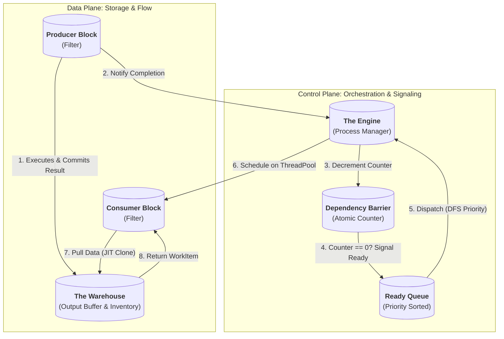
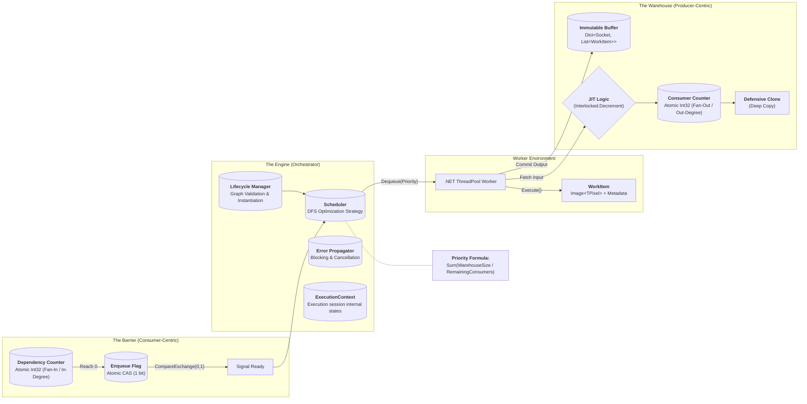
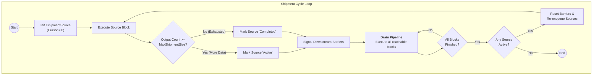

# Image Processing Pipeline: Execution Engine Architecture

## Table of Contents

1. [Architectural Style](#1-architectural-style)
2. [Structural Components](#2-structural-components)
3. [Interaction Patterns](#3-interaction-patterns)
4. [Execution Lifecycle](#4-execution-lifecycle)
5. [Resource Management](#5-resource-management)
6. [Optimization Strategy: Runtime Adaptation](#6-optimization-strategy-runtime-adaptation)
7. [Fault Tolerance & Error Handling](#7-fault-tolerance--error-handling)
8. [Implementation Notes](#8-implementation-notes)
9. [References](#9-references)
10. [Appendix A: Future Enhancements & Known Limitations](#a-appendix-future-enhancements--known-limitations)
11. [Appendix B: Diagrams](#b-appendix-diagrams)
12. [Appendix C: Lexicon](#c-appendix-lexicon)

## 1. Architectural Style

The Execution Engine implements a **Pipes and Filters** architecture governed by a **Dataflow** model.

* **Filters:** `Blocks`[^C.1] — Stateless processing units responsible for transforming data.
* **Pipes:** `Links`[^C.3] — Managed by "`Warehouses`[^C.20]" (Data) and "`Barriers`[^C.21]" (Control) that handle buffering and synchronization.
* **Control Flow:** Driven by data availability (Data-Driven), orchestrated by a central runtime (the `Engine`[^C.22]).
* **Concurrency Model:** Parallel block execution on .NET ThreadPool.

## 2. Structural Components

### 2.1. The Warehouse (Output Buffer)

The `Warehouse`[^C.20] is a storage component attached to the output face of a producer `Block`[^C.1].

* **Affinity:** Producer-Centric (Upstream). It collects results generated by the block.
* **Functionality:**
    1. **Storage:** Holds the `IDictionary<Socket, IReadOnlyList<WorkItem>>` produced by the block (immutable after commit).
    2. **Inventory Tracking:** Maintains a **Consumer Counter** (`int32` atomically decremented) initialized to the output `Socket`'s `Fan-Out / Out-Degree`[^C.28] (number of downstream `links`[^C.3]).
    3. **Distribution:** Serves data to consumers upon request, implementing JIT Cloning logic (see Section 3.2).
* **Key Methods:**
    - `Import(IDictionary<Socket, IReadOnlyList<IBasicWorkItem>> outputs)`: Commits output data to the warehouse.
    - `GetInventory()`: Returns all data (always clones).
    - `GetInventory(IEnumerable<Socket> sockets)`: Returns data for specific sockets (always clones).
    - `DecrementConsumerCount()`: Decrements the consumer count for blocked block cleanup.
* **Properties:**
    - `RemainingConsumers`: Current count of remaining consumers.
    - `TotalSizeMp`: Total size in megapixels of stored items.
* **Thread Safety:**
    - Counter updates use `Interlocked.Decrement`.
    - Data reads for *cloning* (intermediate consumers) are lock-free.
    - Data import and final cleanup (last consumer) use a fine-grained `Lock` to ensure consistency.
* **Lazy Initialization:** Warehouses are allocated on-demand when a block first produces output.

### 2.2. The Dependency Barrier (Control Gate)

The `DependencyBarrier`[^C.21] is a control structure attached to the consumer block.

* **Affinity:** Consumer-Centric (Downstream).
* **Functionality:**
    1. **Readiness Tracking:** Maintains a **Dependency Counter** (`int32` atomically decremented) initialized to the block's `Fan-In / In-Degree`[^C.27] (Total incoming connections).
    2. **Signaling:** When the counter reaches zero via `Signal()`, returns `true` to indicate the block should be enqueued.
* **Properties:**
    - `Block`: The `IBlock` this barrier is attached to.
    - `RemainingDependencies`: Current count of unsatisfied dependencies.
    - `HasEnqueued`: Whether the block has been enqueued (once per cycle).
* **Method:**
    ```csharp
    public bool Signal() {
        int remaining = Interlocked.Decrement(ref dependencyCounter);
        if (remaining == 0) {
            // Atomically set flag to prevent duplicate enqueue
            if (Interlocked.CompareExchange(ref enqueuedFlag, 1, 0) == 0) {
                return true;  // Block should be enqueued
            }
        }
        return false;
    }
    ```

    **Rationale:** Avoids `CountdownEvent` overhead. The `CompareExchange` ensures exactly one enqueueing.

> **Note:** Barriers are not recycled between cycles. They are re-initialized.

* **Lazy Initialization:** Barriers are allocated only when a block's first predecessor completes.

### 2.3. The Engine (Orchestrator)

The `Engine`[^C.22] functions as a **Process Manager**. It is responsible for:

1. **Lifecycle Management:** Instantiating `blocks`[^C.1], `warehouses`[^C.20], and `barriers`[^C.21].
2. **Topology Verification:** Static analysis of the DAG (`Graph`[^C.5]) (Tarjan's algorithm for cycle detection).
3. **Task Dispatching:** Dispatching `Ready`[^C.7] `blocks` based on `Backpressure`[^C.30]-guided DFS using a priority queue (`PriorityQueue<IBlock, Priority>`).
4. **Error Aggregation:** Capturing exceptions, marking downstream `blocks` as `Blocked`[^C.9]/`Failed`[^C.10], and aggregating failures.

### 2.4. The Scheduler

The `Scheduler`[^C.23] is responsible for determining the order of execution. It abstracts the policy (e.g., Simple DFS vs. Adaptive) from the mechanism.

* **Interface (`IScheduler`):**
    - **Readiness Tracking:** Manages the "Ready Queue" of `blocks` whose dependencies are satisfied.
    - **Prioritization:** Decides which ready `block` to execute next based on the active strategy (e.g., Greedy `Completion Pressure`[^C.26]).
    - **Completion Handling:** Signals downstream `barriers` upon `block` `Completion`[^C.11].
    - **Cycle Management:** Handles `shipment`[^C.24] cycle transitions for batched execution.
* **Affinity:** Engine-Centric. It is a component of the `Engine`.

## 3. Interaction Patterns

### 3.1. Synchronization Protocol

Synchronization is split between Data Availability (Producer) and Dependency Resolution (Consumer).

1. **Production:** `Block` executes and places results in its `Warehouse` (atomic commit).
2. **Notification:** The `Scheduler` identifies all connected downstream `Barriers` and atomically decrements their `Dependency Counters` using `Interlocked.Decrement`.
3. **Activation:** If a `Barrier` reaches zero, the consumer `Block` is enqueued to the `Ready Queue`.
4. **Deadlock Prevention:** The `Engine` maintains a watchdog timer; if no progress occurs within a configurable timeout (default: 30s), it performs `Liveness`[^C.12] analysis (not implemented) and throws `PipelineDeadlockException`.

### 3.2. JIT Cloning & Reference Handover

To optimize memory usage, cloning is deferred until the dispatch moment (Pull-based).

* **Logic:** When a consumer `Block` is dispatched, it requests inputs from the upstream `Warehouses`.
* **Check:** The `Warehouse` uses `Interlocked.Decrement` to atomically decrement its `Consumer Counter`.
* **Defensive Cloning:** The `Warehouse` creates a `Clone` per `IBasicWorkItem`'s `Clone` contract and returns the clone. When the `warehouse` is empty (counter after decrement == 0), the `warehouse` nullifies its internal buffer for GC cleanup (ensuring `Safety`[^C.13]).
* **Constraint:** `WorkItem` wraps `Image<TPixel>` from SixLabors.ImageSharp. When cloning, use `image.Clone()`. When transferring (Case B), the original `WorkItem` is moved.
* **Disposal Semantics:**
    - After a `block` finishes execution, the `Engine` calls `workItem.Dispose()` on all consumed inputs (Section 5.2). This disposes the underlying `Image<TPixel>`.
    - **Warehouse Cleanup:** Once Counter reaches 0, the `Warehouse` clears its internal reference (GC handles it).

* **Warehouse Item Distribution Reference:**
    ```csharp
    int remaining = Interlocked.Decrement(ref consumerCounter);
    var clone = _internalBuffer.Clone();
    if (remaining == 0)
    {
        lock (bufferLock)
        {
            _internalBuffer = null; // Last consumer
        }
    }
    return clone;
    ```

## 4. Execution Lifecycle

### Phase 1: Static Validation

1. **Sink Verification:** Confirms at least one Sink/Save `Block` exists.
2. **Source Verification:** Confirms at least one Source/Load `Block` exists.
3. **Port Binding:** Ensures all mandatory input ports are bound.
4. **Cycle Detection:** Verifies the `Graph` is a directed acyclic `Graph`[^C.5] (DAG).
5. **Type Checking:** Validates data contracts. (Deferred)

### Phase 2: Initialization

* **State Construction:**
    - `Barriers`: Created lazily via `ConcurrentDictionary<BlockId, Lazy<Barrier>>`.
    - `Warehouses`: Created on-demand when `blocks` first produce output.
* **Counter Setup:**
    * `Warehouse` Counters = `Fan-Out / Out-Degree`[^C.28] - initialized when `warehouse` is first created.
    * `Barrier` Counters = `Fan-In / In-Degree`[^C.27] - initialized when `barrier` is first accessed.
* **Ready Queue Bootstrap:** All source `blocks` are enqueued immediately.
* **Shipment Source Initialization:** `Blocks` implementing `IShipmentSource` (typically LoadBlock) have their `MaxShipmentSize` property configured from `ExecutorConfiguration.MaxShipmentSize` (default: 64).

### Phase 2.5: Shipment-Based Execution

**Problem:** Loading all images at once causes memory explosion and poor watchdog behavior.

**Solution:** `Graph` executes multiple times, and sources producing batches of `work items`.

#### IShipmentSource Contract

Sources implement this interface to engage in batched execution (`Shipment`[^C.24]).

```csharp
public interface IShipmentSource : IBlock
{
    int MaxShipmentSize { get; set; }
}
```

**Execution Flow** (using standard Load `Block`):

1. **Bootstrap Phase:** `LoadBlock` stores file paths (not images) and initializes internal cursor/offset to 0.
2. **First Execution:** `LoadBlock.Execute()` loads up to `MaxShipmentSize` images (e.g., 64).
3. **Re-enqueue Decision:** Executor checks output count:
    - If `outputCount >= MaxShipmentSize`: `LoadBlock` remains active and is re-enqueued for the next cycle.
    - If `outputCount < MaxShipmentSize`: Mark LoadBlock as `Completed`[^C.11] (exhausted).
4. **Subsequent Executions:** The cycle repeats until all sources are exhausted.
5. **Pipeline Draining:** Downstream `blocks` (Resize, Save, etc.) process each `shipment` normally.

**Benefits:**

* **Memory Control:** `Pipeline` holds max 64 × NumBlocks `WorkItems`, not Total × NumBlocks.
* **Watchdog-Friendly:** Processing occurs in ticks.

**Implementation Notes:**

* **Transparency:** Downstream `blocks` process available inputs.
* **State Persistence:** `LoadBlock` maintains internal state (cursor, file list) across executions.
* **Exhaustion Detection:** `outputCount < MaxShipmentSize` signals no more data next cycle.
* **Progress Tracking:** Uses `ProcessedShipmentCount` to reflect progress.

**Contrast with BatchWorkItem:**

* **Shipments:** Mechanism for memory-controlled processing (multiple executions).
* **BatchWorkItem:** Data structure for grouping images that must undergo identical processing (single execution, multiple images in one `WorkItem`).

### Phase 3: Runtime Loop

The `Engine` runs an asynchronous loop that orchestrates execution:

1. **Watchdog:** Monitors progress to detect `deadlocks`.
2. **Dispatch:** While concurrency limits allow:
    * **Dequeue:** Asks the `Scheduler` for the next "`Ready`" `block`.
    * **Execute:** Spawns a `Task` on the ThreadPool to execute the `block`.
3. **Block Execution:**
    * **Fetch:** Pulls data from upstream `Warehouses`.
    * **Run:** Executes the `block` logic.
    * **Commit:** Stores results in the `block`'s `Warehouse`.
    * **Notify:** Informs the `Scheduler` of `completion` (which signals downstream `barriers`).
4. **Cycle Management:** When all `blocks` `complete`[^C.11], if sources remain active, resets state and begins the next `shipment` cycle.

## 5. Resource Management

### 5.1. Memory Efficiency (Greedy Completion Pressure)

Since `Warehouses` hold data until *all* consumers have read it, "partial consumption" leads to memory retention. The `Scheduler` picks the `block` that clears the most expensive active buffers.

* **Formula:**

    $$Priority(B) = -\sum_{P \in Predecessors(B)} \frac{WarehouseSize(P)}{RemainingConsumers(P)}$$

    (Negative because PriorityQueue is min-heap)

* **Mechanism (Fan-Out Dilution):**
    * **Shared Parents (Low Priority):** If `Block` A feeds B and C (`Fan-Out / Out-Degree`[^C.28]=2), the pressure to execute B is only $Size(A) / 2$.
    * **Exclusive Parents (High Priority):** Once B executes and produces data for SaveB (`Fan-Out / Out-Degree`=1), the pressure to execute SaveB is $Size(B) / 1$.
    * **Result:** Since $Size(B)/1 > Size(A)/2$, the `scheduler` prioritizes the exclusive child (SaveB) over the sibling (C).

* **Natural DFS:** The formula favors following a linear chain over widening the `graph`. This keeps the "working set" of active buffers deep and narrow.

* **Implementation:** Priority calculated locally at enqueue time.

### 5.2. Deterministic Disposal

* **Warehouse Cleanup:** Occurs automatically when the last consumer reads the data. Internal reference is nulled (GC eligible).
* **Input Disposal:** Once a consumer `block` finishes execution, the `Engine` calls `workItem.Dispose()` on consumed input `WorkItems`. This disposes the underlying `Image<TPixel>` objects.

    > **In-Place Mutation Handling:** Many processor `blocks` (e.g., Brightness, Contrast, Vignette) mutate the input image in-place using `Image.Mutate()` and return the **same `WorkItem` object** as output. To prevent disposing items that are also stored in the output `Warehouse`, the `Engine` builds a reference-equality `HashSet` of output items and skips disposal for any input item present in that set.

* **Blocked Blocks:** If a `block` is marked "`Blocked`[^C.9]", the `Engine`:
    1. Atomically decrements upstream `Warehouse` counters for that `block`'s inputs. This ensures `Warehouses` are cleaned up.
    2. Does NOT execute the `block`.
    3. The `Engine` scans for `blocked` downstreams and marks them too.

### 5.3. Global Memory Budget (Both Modes)

To prevent OOM, the `Engine` enforces memory limits:

* **Tracking:**
    ```
    TotalMemoryUsage = Σ (WarehouseSize × WorkItem.SizeMP × BytesPerPixel)
    ```
    Updated atomically after each `Warehouse` commit using `Interlocked.Add`.

* **Soft Limit (Default: 50% of available RAM, configurable):**
    - When exceeded, Source `blocks` check `CanProduce()` before execution
    - If over limit: `block` sleeps 100ms, retries (cooperative `backpressure`[^C.30])
    - Existing in-flight `blocks` continue
    - Priority boost for `blocks` downstream of full `Warehouses` (×2.0)

* **Hard Limit (Default: 75% of available RAM, configurable):**
    - When exceeded, `Engine` has two modes:
        1. **Fail-Fast (Default):** Throw `OutOfMemoryException`.
        2. **Force-Drain (Optional):** Discard oldest `Warehouse` contents, mark consumers as `failed`[^C.10].

* **Memory Estimation:**
    - `BytesPerPixel = 4` for `Rgba32` (default).
    - Includes 10% overhead for metadata/internal structures.

* **Startup Validation:**
    - If available RAM < 2× largest expected WorkItem, log warning.
    - If available RAM < Hard Limit, fail initialization.

## 6. Optimization Strategy: Runtime Adaptation

The `Engine` supports execution modes configured via `ExecutorConfiguration.Mode` (string-based for extensibility):

* **Default Mode**: `"SimpleDfs"` - Depth-first scheduler using greedy completion pressure.

### Mode A: Greedy Completion Pressure (Default, Production-Ready)

Uses pure `Completion Pressure`[^C.26] with no live profiling or depth calculation.

* **Key Properties:**
    - **Simple:** No depth computation, no arbitrary constants.
    - **Greedy:** Picks the `block` that frees the most memory.
    - **Natural DFS:** Paths with accumulated `warehouses` become progressively "hungrier".
    - **Overhead:** Low per enqueue.
    - **Deterministic:** Priority calculated once at enqueue.

### Mode B: Adaptive (Deferred)

Extends Mode A with live profiling and `Critical Path`[^C.29] analysis.

**Key Difference from Mode A:** Mode B **extends** Mode A's `Completion Pressure` with cost-aware adjustments.

#### Shipment Boundary Micro-Optimization

**Challenge:** With `shipment`-based execution, the `pipeline` completes a "mini-cycle" after each `shipment`. Mode B recomputes `critical paths` at these boundaries.

**Options:**

1. **Conservative:** Only recompute after full cycles.
2. **Aggressive:** Recompute after every `shipment`.
3. **Hybrid:** Configurable.

---

### 6.1. Dynamic Priority Adjustment (Mode B Only)

Mode B **extends** Mode A's `Completion Pressure` with runtime cost profiling:

* **Base Priority:** Same as Mode A.

* **Cost-Weighted Boost (Dynamic):** Applied when dequeueing from Ready Queue:

    $$Priority_{runtime}(B) = Priority_{base}(B) - \alpha \times \hat{Cost}(B) \times AvgInputSize(B)$$

    where:
    - $\hat{Cost}(B)$ = profiled cost per megapixel.
    - $AvgInputSize(B)$ = average input `WorkItem` size in megapixels.
    - $\alpha = 0.1$ (tunable).
    - **Sign Convention:** Negative because expensive `blocks` should run sooner.

* **Critical Path Multiplier:** If B is on the current `Critical Path` (Section 6.3):

    $$Priority_{runtime}(B) = Priority_{runtime}(B) \times 1.5$$

* **Update Frequency:** Priorities recalculated at dequeue time.

* **Fallback Behavior:** If profiling data is insufficient, Mode B falls back to pure Mode A priority.

### 6.2. Incremental Cost Profiling (Mode B Only)

The `Engine` maintains a `Rolling Statistics Window` per `block` type.

* **Metric Collection:** After each `block` execution, record:

    $$Sample_i = \left( T_{exec,i}, PixelCount_i, \frac{T_{exec,i}}{PixelCount_i} \right)$$

* **Cost Estimate (Exponential Moving Average):**

    $$\hat{Cost}(B) = \alpha \times \frac{T_{current}}{PixelCount_{current}} + (1-\alpha) \times \hat{Cost}_{previous}(B)$$

* **Variance Tracking:** Maintains $\sigma^2$ to detect unstable `blocks`.

* **Persistence:** Statistics serialized to `~/.cache/pipeline/profile.db` (SQLite).

### 6.3. Critical Path Identification (Live) (Mode B Only)

The `Critical Path` is recomputed **conditionally**.

#### Simple Heuristic (Default):

Recompute when ANY of:
1. **Performance Deviation:** Live execution time deviates >20% from projected.
2. **Sampling Interval:** Every 10 `blocks` `complete`.
3. **Time-Based:** Every 5 seconds.

**Algorithm:** Modified Bellman-Ford with negative edge weights.

**Priority Boost:** `Blocks` on the `Critical Path` receive multiplicative boost (×1.5).

#### Advanced Strategy (Optional):

**Batch Scheduling with Grouped Recomputation:**

* **Mechanism:** Accumulate a "batch" of K `ready blocks`.
* **Dispatch:** Sort batch by priority, dispatch all K in parallel.
* **Recomputation:** Recalculate `Critical Path` **once** after all K `complete`.

### 6.4. Calibration Mode (First-Run Only) (Mode B Only)

On first startup (no cached profiles), the `Engine` runs a `Synthetic Benchmark Suite`.

* **Test Set:** 10 synthetic images per `block` type.
* **Output:** Seeds initial $\hat{Cost}(B)$ estimates.
* **Fallback:** Uses conservative defaults based on `block` category.

### 6.5. Thermal & Load Adaptation (Both Modes)

The `Engine` monitors system conditions and adjusts parallelism:

* **CPU Throttling Detection:** If `block` durations increase >30% across 5 consecutive executions, reduce `MaxDegreeOfParallelism` by 25%.
* **Memory Pressure:** If GC collections exceed 10/second, pause new `block` dispatches.
* **External Load:** Uses `Environment.ProcessorCount` and current CPU usage.

## 7. Fault Tolerance & Error Handling

### 7.1. Exception Propagation

* **Block Failure:** If a `block` throws an exception:
    1. **Downstream Blocking:** Initiates a `liveness` check to mark affected downstream `blocks` as "`Blocked`"[^C.9].
        * **Blocking Nature:** A `failed` `block` is treated as a `blocking` upstream.
        * **Decision Logic:** When a `block` `fails`, the `Engine` verifies the `liveness` of immediate downstream `blocks`.
        * **Propagation:** Propagates recursively (BFS).
    2. **Warehouse Counter Cleanup:** Atomically decrements upstream `Warehouse` counters.
    3. Collects the exception into an `AggregateException`.
    4. Allows independent `pipeline` branches to continue.
* **Fatal Errors:** Out-of-memory or stack overflow abort the entire `pipeline` immediately.

### 7.2. Cancellation Support

* **Cooperative Cancellation:** `Engine` accepts `CancellationToken`. `Blocks` poll the token.
* **Cleanup:** On cancellation, the `Engine` disposes all `Warehouses` and marks the `pipeline` as "Aborted".

> **Note:** `Block` implementations support cancellation via the `CancellationToken` parameter.

## 8. Implementation Notes

### 8.1. Data Structures

* **Ready Queue:** `System.Collections.Generic.PriorityQueue<IBlock, float>` (guarded by lock).
* **Warehouse Storage:** `ImmutableList<WorkItem>` (guarded by lock for write/clear, lock-free for read).
* **Barrier Counter:** `int` with `Interlocked` operations (lock-free).
* **Lazy Components:** `ConcurrentDictionary<IBlock, Lazy<T>>`.

### 8.2. Threading Model

* **Execution:**
    - **Default:** `Task.Run` (runs on ThreadPool).
* **Coordination:** Single async loop in `GraphExecutor`.

### 8.3. Concurrency & Synchronization

The system employs a **Hybrid Concurrency Model**:

* **Atomic Operations (`Interlocked`):**
    - Used for `Dependency Barriers`.
    - Used for `Warehouse Consumer Counts`.

* **Fine-Grained Locks (`System.Threading.Lock`):**
    - **Scheduler Queue:** Protects the PriorityQueue.
    - **Warehouse Inventory:** Protects the import (commit) and the final cleanup.
    - **Active Sources:** Protects the list of active `shipment` sources.

### 8.4. WorkItem Structure

```csharp
public sealed class WorkItem : IDisposable
{
    public Image Image { get; }       // SixLabors.ImageSharp
    public float SizeMP { get; }      // Width × Height / 1,000,000
    public IImmutableDictionary<string, object> Metadata { get; }

    public WorkItem Clone() => new WorkItem(
        Image.Clone(x => {}),         // Deep copy of pixel data
        SizeMP,
        Metadata                      // Shallow copy (immutable)
    );

    public void Dispose() => Image.Dispose(); // Release unmanaged pixel buffer
}
```

## 9. References

1. **POSA:** Buschmann, F., et al. (1996). *Pattern-Oriented Software Architecture Volume 1*.
2. **EIP:** Hohpe, G., & Woolf, B. (2003). *Enterprise Integration Patterns*.
3. **GoF:** Gamma, E., et al. (1994). *Design Patterns*.
4. **Memory Management:** Jones, R., et al. (2011). *The Garbage Collection Handbook*.
5. **Concurrent Data Structures:** Herlihy, M., & Shavit, N. (2012). *The Art of Multiprocessor Programming*.
6. **Graph Algorithms:** Cormen, T. H., et al. (2009). *Introduction to Algorithms, 3rd Ed*.
7. **Adaptive Systems:** Hellerstein, J. L., et al. (2004). *Feedback Control of Computing Systems*.

---

## A. Appendix: Future Enhancements & Known Limitations

### A.1. Scalability: Priority Queue Contention

**Current Bottleneck:**
Under extreme parallelism (>100 concurrent threads), the single `ConcurrentPriorityQueue` can become a contention point.

**Proposed Solution: Two-Tier Scheduling**

Partition the `ready` queue into two tiers:

* **Tier 1 (Fast Path):** FIFO queue for `blocks` with uniform priority.
* **Tier 2 (Slow Path):** Priority queue for memory-pressure-sensitive `blocks`.

### A.2. Memory Management: Predictive Backpressure

**Current Limitation:**
GC-based throttling is **reactive**. The system can accumulate excessive in-flight memory before throttling triggers.

**Proposed Solution: Global Memory Budget with Soft/Hard Limits** (Section 5.3)

### A.3. Clarification: Priority Staleness

**Actual Behavior (Both Modes):**

Priorities are computed **on-demand during dequeue**, not cached:

* **Mode A:** Each `Dequeue()` calculates `Completion Pressure` from current `Warehouse` states.
* **Mode B:** Each `Dequeue()` calculates `Completion Pressure` + Cost-Weighted Boost + `Critical Path` Multiplier.

### A.4. Advanced Research: Adaptive Work Batching

**Concept:** Instead of recalculating priorities per-`block`, accumulate batches of K `ready blocks` before scheduling.

### A.5. Known Limitations

1. **No GPU Memory Tracking:** Current memory budget only tracks CPU RAM.
2. **No Network I/O Backpressure:** If `blocks` fetch from network sources, the memory budget doesn't account for in-flight network buffers.
3. **Barrier Allocation:** `Barriers` are allocated per-`block` (not per-execution).
4. **Priority Queue Scalability:** Single queue design limits scalability beyond ~100 threads.
5. **No Priority Inheritance:** System doesn't propagate priority from consumer to producer.

### A.6. Observability and Telemetry

**Current Limitation:** Debugging parallel `graph` execution via logs is difficult.

**Proposed Enhancement:** Integrate OpenTelemetry .NET instrumentation.

### A.7. Static Analysis: Strict Paths & Threatened Blocks

The static analyzer performs offline `graph` analysis to identify structural sensitivity patterns.

## B. Appendix: Diagrams

### B.1. High-level diagram



### B.2. Detailed Diagram



### B.3. Execution Diagram


### B.4. Shipment Lifecycle Diagram



## C. Appendix: Lexicon

[^C.1]: Stateless processing unit implementing `IBlock`. Transforms input `WorkItem`s into output `WorkItem`s.
[^C.2]: Named input or output port on a block. Defines the typed interface for data flow.
[^C.3]: Directed connection between sockets. Establishes producer-consumer relationship.
[^C.4]: Logical subset of blocks for analysis (e.g., "strict path subgraph"). Not a formal graph cut.
[^C.5]: Complete DAG of blocks and links. Validated for acyclicity before execution.
[^C.6]: Synonym for the execution graph during a processing session.
[^C.7]: Block with all dependency barriers satisfied. Eligible for dispatch.
[^C.8]: Dispatched block awaiting completion. In-flight execution.
[^C.9]: Block unable to execute due to upstream failure. Transitive—propagates downstream.
[^C.10]: Block that threw an exception. Marks downstream as blocked.
[^C.11]: Block that finished successfully. Output committed to warehouse.
[^C.12]: Property that system continues making progress. Blocks complete; watchdog detects violations.
[^C.13]: Property that no `WorkItem` is lost or corrupted. Enforced via cloning and cleanup.
[^C.14]: Completed block output is immutable and never rolled back.
[^C.15]: Block with In-Degree = 1. Single point of failure if upstream fails.
[^C.16]: Transitive closure of upstream dependencies from a strict block.
[^C.17]: Block that may become blocked if specific upstream fails. Precomputed by analyzer.
[^C.18]: Set of blocks that must complete to unblock a strict downstream.
[^C.19]: Set of upstream blocks whose failure prevents downstream execution.
[^C.20]: Producer-centric output buffer holding `WorkItem`s until all consumers consume.
[^C.21]: Consumer-centric synchronization primitive with atomic dependency counter.
[^C.22]: Central orchestrator managing lifecycle, scheduling, error handling, resources.
[^C.23]: Policy component determining dispatch order via Completion Pressure or Adaptive strategies.
[^C.24]: Batch of `WorkItem`s from a source in one cycle. Enables memory-controlled processing.
[^C.25]: Immutable wrapper of `Image<TPixel>` with metadata. Disposable.
[^C.26]: Scheduling priority based on warehouse memory. $-\sum (Size / RemainingConsumers)$.
[^C.27]: Number of incoming links. Determines barrier counter initialization.
[^C.28]: Number of outgoing links. Determines warehouse counter initialization.
[^C.29]: Longest path from source to sink. Used in Mode B for priority boosting.
[^C.30]: Flow control limiting production when downstream exhausted. Via soft/hard memory limits.
[^C.31]: Liveness violation—no blocks ready but execution incomplete. Detected by watchdog.